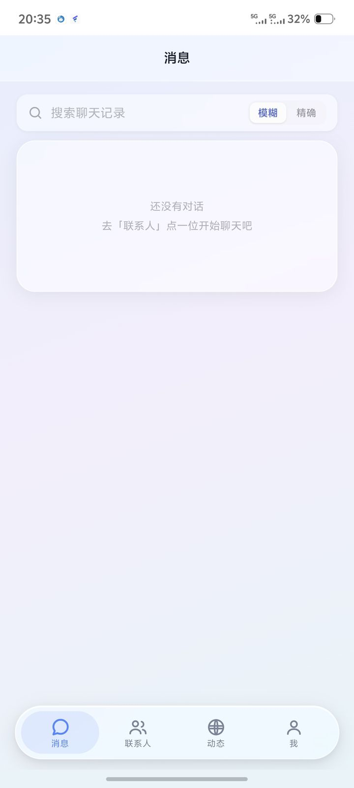
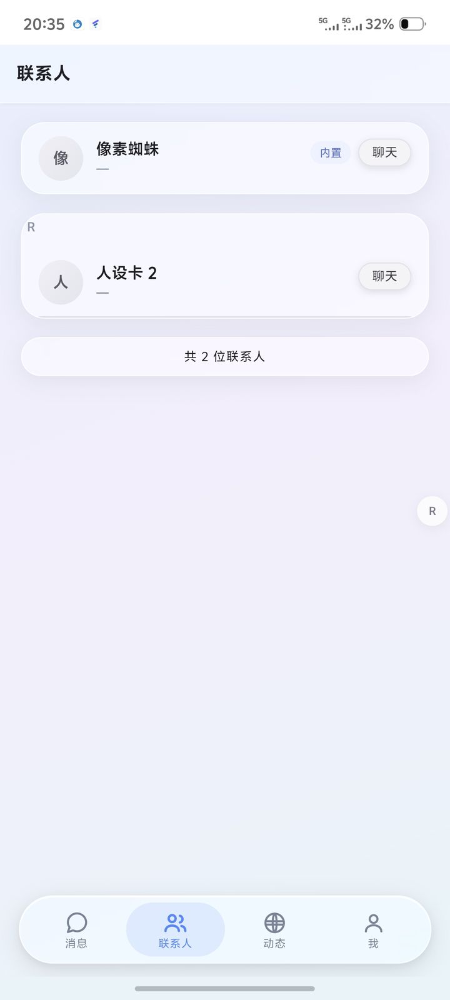
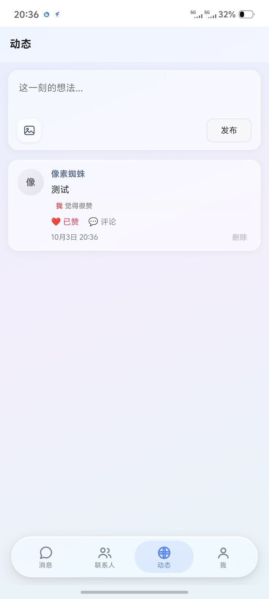
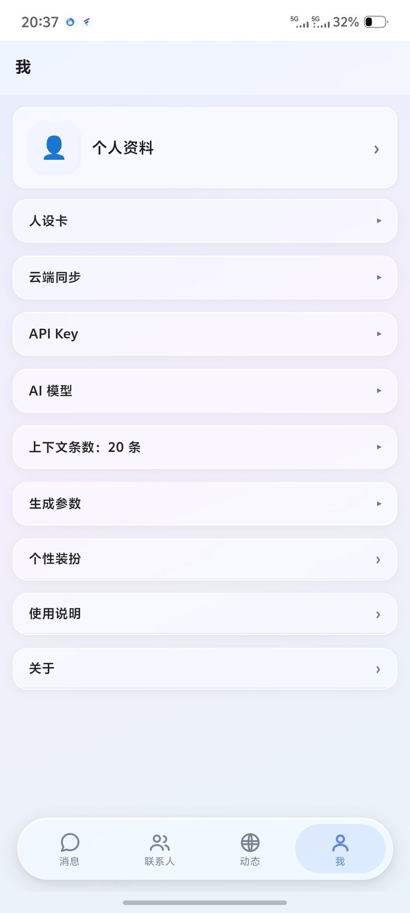

# 蛛丝（像素蜘蛛）

> 自用 AI 聊天前端 · 纯 HTML / CSS / JS，无框架 · Supabase 做云端后端

一个跑在浏览器里的轻量 AI 聊天应用，个人学习与技术研究用途，不提供商业服务。

线上地址：https://lueyoyo1-afk.github.io/xxzzAizhusi/

---

## 截图

| 消息 | 联系人 |
|---|---|
|  |  |

| 动态 | 我 |
|---|---|
|  |  |

---

## 功能

- 💬 **真对话** — 对接大模型接口，支持上下文记忆、流式输出
- 📝 **Markdown 渲染** — 代码块、列表、加粗等本地渲染（marked）
- 🗂️ **多会话 / 多人设** — 人设卡系统，可自定义 systemPrompt，内置不可删的默认卡
- 🖼️ **图片消息** — 支持发送图片，多模态理解
- 🔐 **账号系统** — 登录/注册/找回密码，多账号数据隔离
- ☁️ **云端同步** — Supabase 存聊天记录与人设卡，多设备可拉取
- 📱 **移动端优先** — 为手机屏幕做的界面，底部悬浮胶囊 Tab、侧滑抽屉
- ⚙️ **在线更新** — Service Worker 静默拉新版，「检查更新」可比对 version.json

## 技术栈

| 层 | 用的东西 |
|---|---|
| 界面 | 原生 HTML + CSS + JavaScript（无框架） |
| 后端 | Supabase（Auth + Postgres） |
| Markdown | marked（本地化，不联网） |
| 离线/更新 | Service Worker |

## 结构

- `index.html` — 页面骨架
- `style.css` — 样式
- `core_v3.js` — 全部逻辑
- `lib/marked.min.js` — Markdown 渲染
- `lib/supabase.js` — 云端同步 SDK
- `sw.js` — Service Worker（离线缓存 + 自动更新）
- `version.json` — 版本号，供「检查更新」比对

## 配置

首次运行需要在应用内自行配置以下内容（**仓库里不含任何密钥**）：

- **模型接口** — 在「设置 → API Key」里填入自己的 API Key
- **云端同步** — 需自备 Supabase 项目，填入项目地址与匿名 Key（可选，不填则仅本地使用）

## 更新流程

1. 改 `index.html` / `style.css` / `core_v3.js`，并同步改 `version.json` 里的 `build` +1、`version` 改号
2. 推送到 GitHub，Pages 自动部署
3. App 里点「我 → 关于 → 检查更新」，或重开 App 由 Service Worker 静默拉新版

## 本地预览

需要用 HTTP 服务器打开（Service Worker 在 `file://` 下不可用）：

```
python3 -m http.server 8000
```

## 致谢

- [marked](https://github.com/markedjs/marked) — Markdown 渲染
- [supabase-js](https://github.com/supabase/supabase-js) — 云端同步

---

## 说明

仅供个人学习使用，非商业项目，不提供任何形式的担保。使用即视为已理解并同意。
